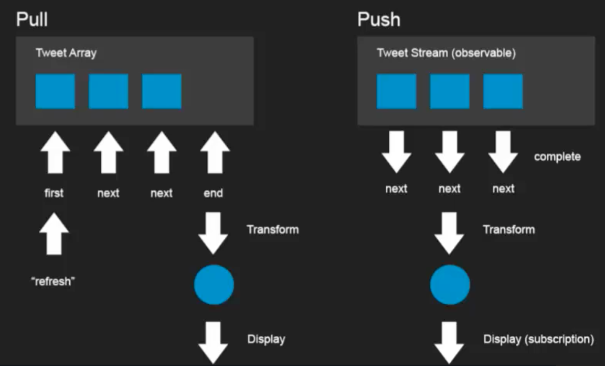

# Udemy - Reactive JS

##  Introduction

Reactive Programming - way of thinking:
* describing application in terms of data flowing through pipelines of transformation
* responding to pipelines changes
* result - much more concise code and easier to understand

## Programming Paradigms

1. Procedural:
* Collection of functions that executes from top to bottom 
* "Imperative" execution
* Relies heavily on global state
* Simple to write and easy to understand
* Difficult to maintain and prone to difficult bugs

2. Object-Oriented:
* Object = state and behavior
* Objects have well defined interfaces
* Pros:
    * Behavior is localized
    * Objects control state
    * Composition
    * Code is still imperative
* Cons:
    * Can be more verbose
    * Code is still imperative

3. Declarative:
* More like data than code
* Pros:
    * Data is self-describing
    * As powerful as the interpreter allows
* Cons:
    * As limiting as the interpreter allows
* Examples: SQL, RegExp, HTML, CSS

4. Functional:
* Falls into declarative programming
* Primitive: function
* Little state
* Few side effects
* Functions do not operate on state, they return new state and have very little side effects
* There are any loops
* Pros:
    * Easy to reason about
    * Composition of functions
    * Expressive
    * Works great with OO
    * Basis in higher math
* Cons:
    * Thinking differently
    * Not always the best choice
    * Basis in higher math

5. Reactive:
* Primitive: Observable
* Describes the data in terms of streams of event, streams of changes or timers or whatever 
* We create a pipeline of that sort of things so that when certain pieces of data change that pipeline gets processed
* We combine the sources of data and manipulate not the sources themselves but the data they return
* We are saying declaratively and reactively what we want to have and how to react on changes of values
* We have the streams of events the stream of data and we want to create pipeline to transform the data to sth we can use
* If we don't use reactive programming we use callbacks - this is facilitation
* Pros: 
    * Composition
    * Expressive
    * Data flows unidirectionally
* Cons:
    * Thinking differently
* Example: Formulas in spreadsheet  

## Basic Concepts

1. Push vs Pull:

* Pull model:
    * Collection/Iterator/Array of objects that we ask for in some point
    * We request a data on the basis of some event or sth else

* Push model:
    * Reactive model
    * Data source itself contains all the concepts all the behavior that it needs in order to determine when it has new data, error occurs or stream completes
    * Observable = reactive data source that produces items over a period of time (and may at some point of time complete)
    * We hook on this pipeline

2. Everything is a Database:
* 

3. Where does RX fit in:
*

